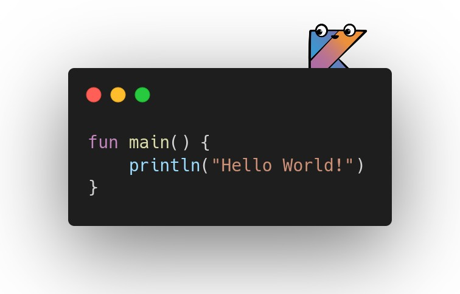
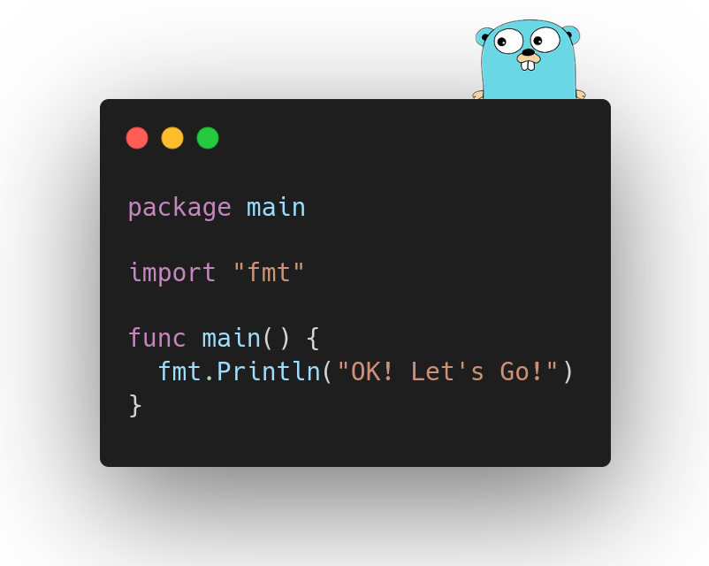

### Hi there 👋
I am a Software Engineer with 4+ years of experience providing growth to startups. Over the years, I have worked in close proximity with domain experts and provided them with the ecosystem to reach a high volume of customers.

## Currently Building stuff with
 

## 🌐 Socials:
  

# 💻 Tech Stack:
                                 	         
# 📊 GitHub Stats:
 
 

## 🏆 GitHub Trophies

### ✍️ Random Dev Quote

---

